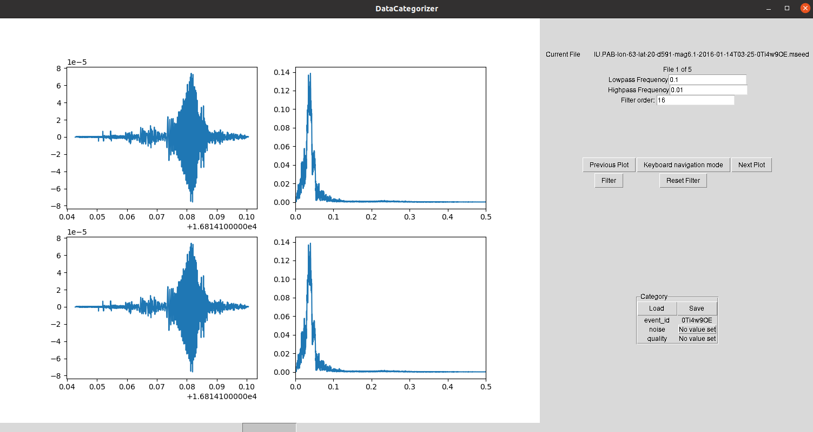

# WaveformCategorizer
This repo contains python code for categorizing waveforms quickly.

## Usage
To use run

```
python run.py
```

The `run.py` file contains options for the maximum frequency to use in the plot of the Fourier spectra as well as for the folder containing the waveforms.


# Example image
<picture>
 
</picture>
